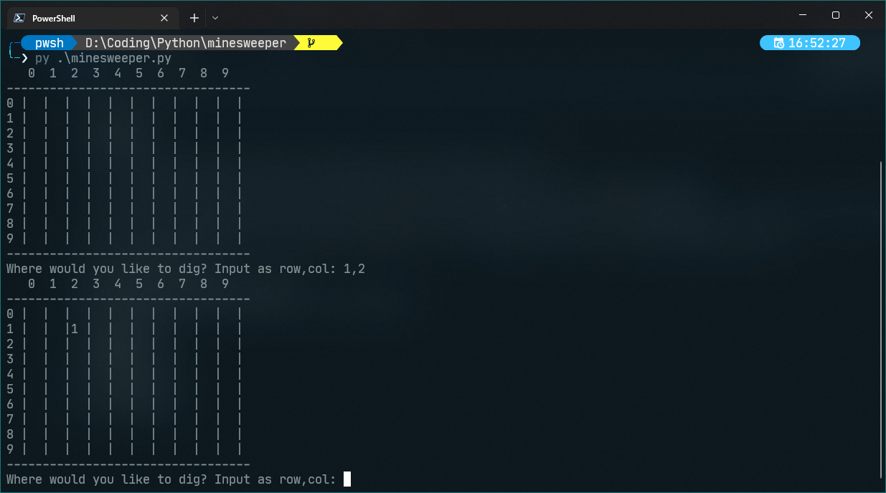

# minesweeper
2D minesweeper

Note that the inputs must be that the number of bombs is less than the total number of spaces (n^2).

For now, this script does not have a GUI and you can use terminal :D (If you want to make a GUI, feel free to make a pull request)

In order to "dig" at a certain location, you type in the index of the row, then the column, separated by a comma (whitespace optional). The game "digs" recursively around that location if there are no bombs nearby.

You can continue digging until either you hit a bomb (which is game over) or you've successfully dug up all n-b non-bomb locations (which is victory)!

This repo contains two files:

minesweeper.py: implementation of minesweeper
minesweeper_empty.py: empty code template for you to start somewhere :)

## Run the program:
```powershell
# Windows:
python3 minesweeper.py

# Linux and MacOS
python minesweeper.py
```

## Image:

